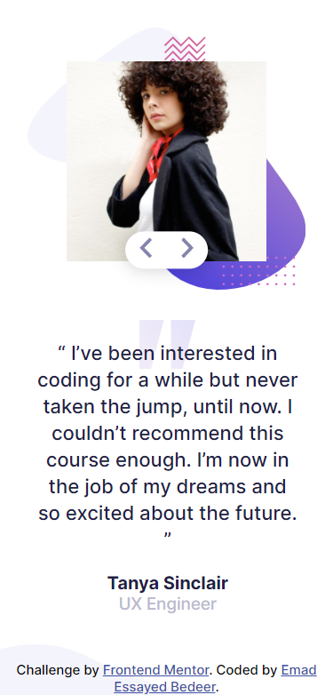
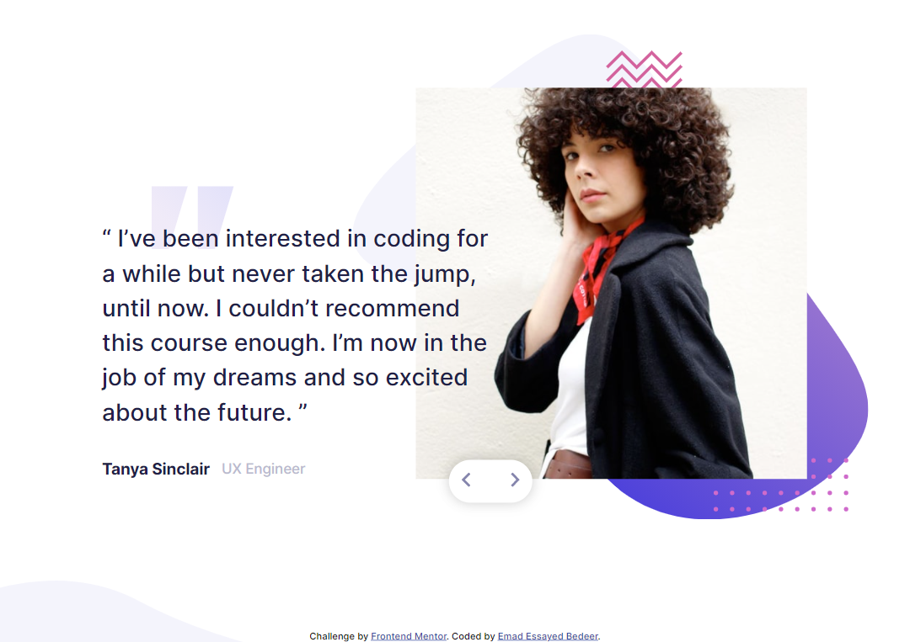

# Frontend Mentor - Coding bootcamp testimonials slider solution

This is a solution to the [Coding bootcamp testimonials slider challenge on Frontend Mentor](https://www.frontendmentor.io/challenges/coding-bootcamp-testimonials-slider-4FNyLA8JL). Frontend Mentor challenges help you improve your coding skills by building realistic projects.

## Table of contents

- [Overview](#overview)
  - [The challenge](#the-challenge)
  - [Screenshot](#screenshot)
  - [Links](#links)
- [My process](#my-process)
  - [Built with](#built-with)
- [Author](#author)

## Overview

### The challenge

Users should be able to:

- View the optimal layout for the app depending on their device's screen size

### Screenshot

### Links

Solution URL: [https://github.com/Emad-Essayed/Frontend-Mentor-Coding-bootcamp-testimonials-slider](https://github.com/Emad-Essayed/Frontend-Mentor-Coding-bootcamp-testimonials-slider)

- Live Site URL: [https://emad-essayed.github.io/Frontend-Mentor-Coding-bootcamp-testimonials-slider/](https://emad-essayed.github.io/Frontend-Mentor-Coding-bootcamp-testimonials-slider/)

## My process

### Built with

- Semantic HTML5 markup
- CSS3
- Flexbox
- Mobile-first workflow

## Author

- Website - [Emad Esaayed Bedeer](https://github.com/Emad-Essayed)
- Frontend Mentor - [@Emad Bedeer](https://www.frontendmentor.io/profile/Emad-Essayed)
- LinkedIn - [@Emad Bedeer](https://www.linkedin.com/in/emad-bedeer-4b1797106/)
